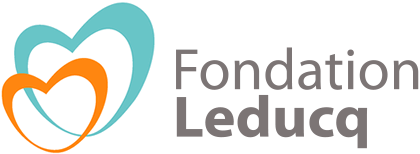

## Plasma Lipoprotein Lipase is associated with Risk for Future Major Adverse Cardiovascular Events in Patients Following Carotid Endarterectomy

<!-- Please add a brief introduction to explain what the project is about    -->
Joost Mekke1, Maarten C. Verwer1, Erik S.G. Stroes2, Jeffrey Kroon2, Leo Timmers3, Gerard Pasterkamp4, Gert Jan de Borst1, Sander W. van der Laan4, Dominique P.V. de Kleijn1,5.
    
1) Department of Vascular Surgery, Division of Surgical Specialties, University Medical Center Utrecht, Utrecht University, Utrecht, the Netherlands. 2) Department of Experimental Vascular Medicine, Amsterdam Cardiovascular Sciences, Amsterdam UMC, location AMC, Amsterdam, the Netherlands. 3) Department of Cardiology, St. Antonius Hospital Nieuwegein, Nieuwegein, The Netherlands. 4) Central Diagnostic Laboratory, Division Laboratories and Pharmacy, University Medical Center Utrecht, Utrecht University, Utrecht, the Netherlands. 5) Netherlands Heart Institute, Utrecht, The Netherlands.

### Abstract

**Introduction** Carotid plaque intraplaque hemorrhage (IPH) is associated with future cardiovascular events. For this, we hypothesized that plasma proteins associated with carotid plaque IPH are also likely to be associated with Major Adverse Cardiovascular Events (MACE) after carotid endarterectomy (CEA).

**Methods** In pre-operative blood samples from patients undergoing CEA within the Athero-Express biobank, we measured proteins involved in cardiovascular disease using three OLINK® proteomics immunoassays. We analyzed the association of proteins with IPH using logistic regression analyses. Subsequently, we analyzed the association of the IPH associated plasma proteins with the three-year postoperative risk of MACE (including stroke, myocardial infarction or cardiovascular death).

**Results** Within the three-year follow-up, 130 patients (18,9%) out of 688 symptomatic and asymptomatic patients undergoing CEA developed MACE. We found that six out of 276 plasma proteins were significantly associated with IPH, from which only Lipoprotein Lipase (LPL) was associated with the postoperative risk of MACE undergoing CEA. Within the 30-day perioperative period high plasma LPL was independently associated with an increased risk for MACE (adjusted HR per SD:1.60(1.10-2.30), p=0.014). From 30-days up and till 3-years, however, high LPL was associated with a lower risk for MACE (adjusted HR per SD:0.80(0.65-0.99), p=0.036).

**Conclusion** High LPL concentrations, were found to be associated with a higher risk for MACE in the first 30 postoperative days but associated with a lower risk MACE in the time period from 30 days up and till 3 years, meaning that LPL has different hazards at different time points. 

### Where do I start?

You can load this project in RStudio by opening the file called 'AE_OLINK_LPL_and_MACE.Rproj'.

#### Project structure

<!--  You can add rows to this table, using "|" to separate columns.         -->
File                        | Description                 | Usage         
--------------------------- | --------------------------- | --------------
README.md                   | Description of project      | Human editable
AE_OLINK_LPL_and_MACE.Rproj | Project file                | Loads project 
LICENSE                     | User permissions            | Read only     
.worcs                      | WORCS metadata YAML         | Read only     
renv.lock                   | Reproducible R environment  | Read only     
images                      | image directory for project | Human editable
scripts                     | Scripts directory           | Human editable

<!--  You can consider adding the following to this file:                    -->
<!--  * A citation reference for your project                                -->
<!--  * Contact information for questions/comments                           -->
<!--  * How people can offer to contribute to the project                    -->
<!--  * A contributor code of conduct, https://www.contributor-covenant.org/ -->

### Reproducibility

This project uses the Workflow for Open Reproducible Code in Science (WORCS) to
ensure transparency and reproducibility. The workflow is designed to meet the
principles of Open Science throughout a research project. 

To learn how WORCS helps researchers meet the TOP-guidelines and FAIR principles,
read the preprint at https://osf.io/zcvbs/

#### WORCS: Advice for authors

* To get started with `worcs`, see the [setup vignette](https://cjvanlissa.github.io/worcs/articles/setup.html)
* For detailed information about the steps of the WORCS workflow, see the [workflow vignette](https://cjvanlissa.github.io/worcs/articles/workflow.html)

#### WORCS: Advice for readers

Please refer to the vignette on [reproducing a WORCS project]() for step by step advice.
<!-- If your project deviates from the steps outlined in the vignette on     -->
<!-- reproducing a WORCS project, please provide your own advice for         -->
<!-- readers here.                                                           -->

### Citations

Using our work? Please cite our work:

    Plasma Lipoprotein Lipase is associated with Risk for Future Major Adverse Cardiovascular Events in Patients Following Carotid Endarterectomy
    Joost Mekke, Maarten C. Verwer, Erik S.G. Stroes, Jeffrey Kroon, Leo Timmers, Gerard Pasterkamp, Gert Jan de Borst, Sander W. van der Laan, Dominique P.V. de Kleijn.
    medRxiv 2022.05.02.22273844; doi: https://doi.org/10.1101/2022.05.02.22273844

### Data availability

The data used in this project are available through a [DataverseNL repository](https://dataverse.nl/dataset.xhtml?persistentId=doi:10.34894/S8PXOJ "Replication Data for: Plasma Lipoprotein Lipase is associated with Risk for Future Major Adverse Cardiovascular Events in Patients Following Carotid Endarterectomy"). The data are sensitive since they involve personal information of patients. There are also restrictions on use by commercial parties, and on sharing openly based on (inter)national laws and regulations and the written informed consent. Therefore these data (and additional clinical data) are only available upon discussion and signing a Data Sharing Agreement (see Terms of Access) and within a specially designed UMC Utrecht provided environment. 

### Acknowledgements, disclosures, and funding

We are thankful for the support of the Netherlands CardioVascular Research Initiative of the Netherlands Heart Foundation (CVON 2011/B019 and CVON 2017-20: Generating the best evidence-based pharmaceutical targets for atherosclerosis [GENIUS I&II]), the ERA-CVD program 'druggable-MI-targets' (grant number: 01KL1802), and the Leducq Fondation 'PlaqOmics'.

Funding for this research was provided by a EU H2020 TO_AITION grant no. 848146 (to Dr. Sander W. van der Laan).

Dr. Sander W. van der Laan has received Roche funding for unrelated work.

Plaque samples are derived from arterial endarterectomies as part of the [Athero-Express Biobank Study](https://doi.org/10.1007/s10564-004-2304-6) which is an ongoing study in the UMC Utrecht. We would like to thank all the (former) employees involved in the Athero-Express Biobank Study of the Departments of Surgery of the St. Antonius Hospital Nieuwegein and University Medical Center Utrecht for their continuing work. In particular we would like to thank (in no particular order) Marijke Linschoten, Arjan Samani, Petra H. Homoed-van der Kraak, Tim Bezemer, Tim van de Kerkhof, Joyce Vrijenhoek, Evelyn Velema, Ben van Middelaar, Sander Reukema, Robin Reijers, Joëlle van Bennekom, and Bas Nelissen. Lastly, we would like to thank all participants of the Athero-Express Biobank Study; without you these studies would not be possible.

     

#### Changes log

    Version:      v1.0.0 
    Last update:  2022-09-05 
    Written by:   Joost M. Mekke; Sander W. van der Laan.
        
    * v1.0.0 Initial version.

------------------------------------------------------------------------

#### Creative Commons BY-NC-ND 4.0

##### Copyright (c) 2022. [Joost M. Mekke](https://github.com/jmekke) \| [Sander W. van der Laan](https://github.com/swvanderlaan).
This is a human-readable summary of (and not a substitute for) the [license](LICENSE). You are free to: Share, copy and redistribute the material in any medium or format. The licencor cannot revoke these freedoms as long as you follow the license terms.

Under the following terms: 
-   Attribution --- You must give appropriate credit, provide a link to the license, and indicate if changes were made. You may do so in any reasonable manner, but not in any way that suggests the licensor endorses you or your use. 
-   NonCommercial --- You may not use the material for commercial purposes. 
-   NoDerivatives --- If you remix, transform, or build upon the material, you may not distribute the modified material. 
-   No additional restrictions --- You may not apply legal terms or technological measures that legally restrict others from doing anything the license permits.

Notices: You do not have to comply with the license for elements of the material in the public domain or where your use is permitted by an applicable exception or limitation. No warranties are given. The license may not give you all of the permissions necessary for your intended use. For example, other rights such as publicity, privacy, or moral rights may limit how you use the material.
